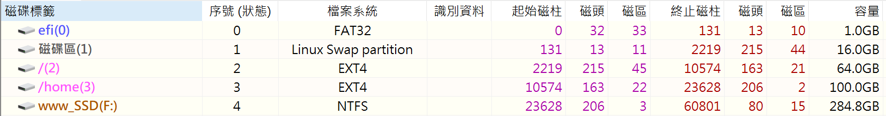
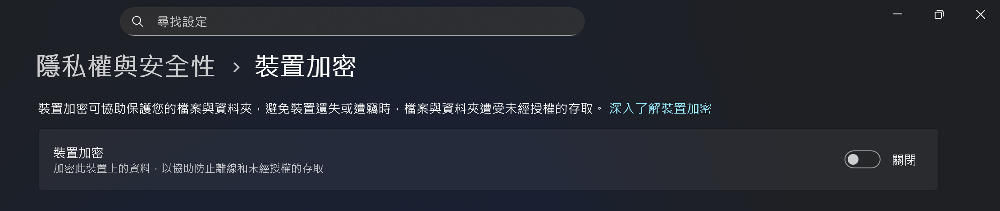
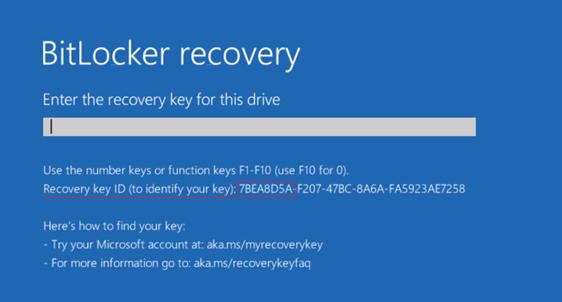
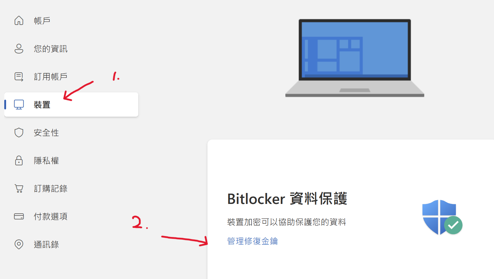
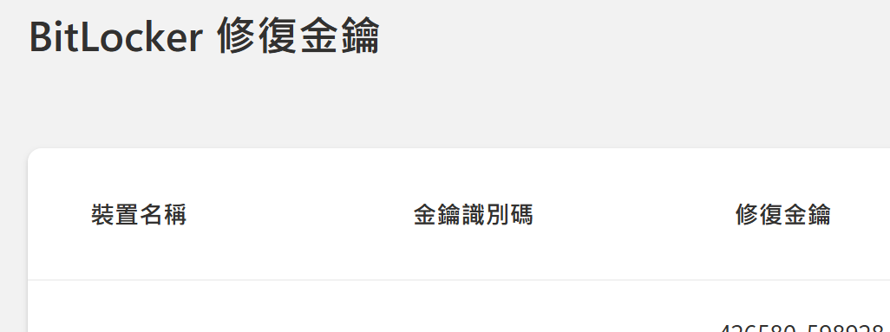
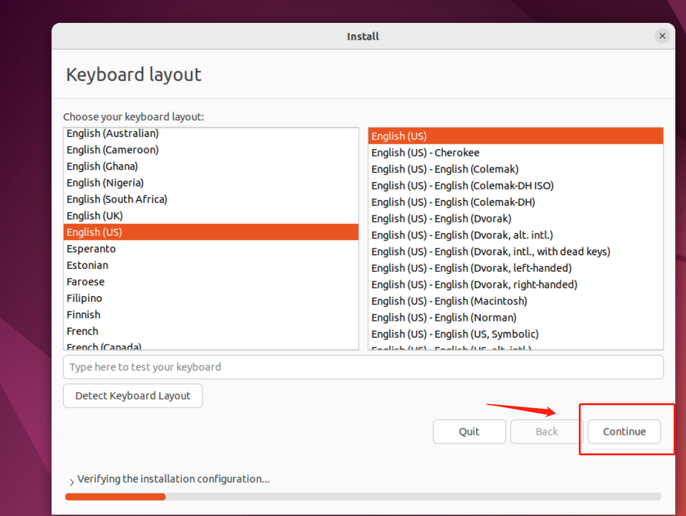
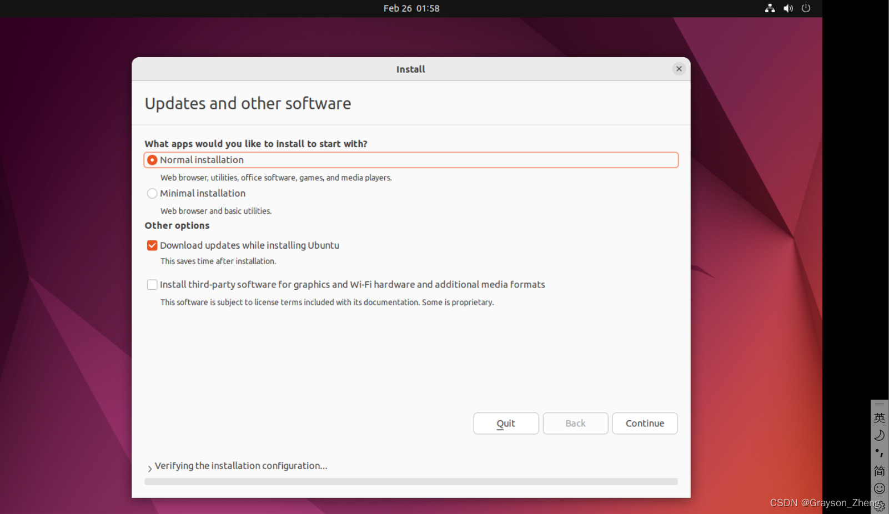
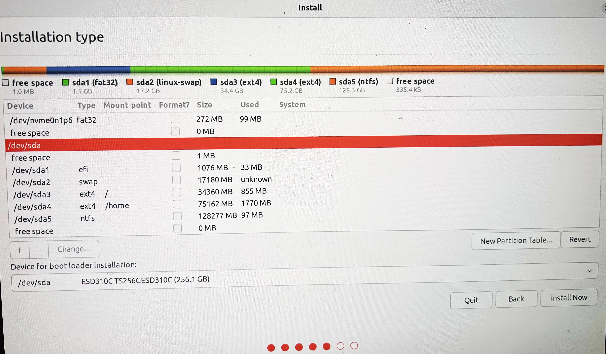
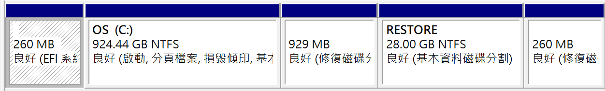

>在日常大多使用 windows 系統，此專題為了提高穩定性，需要安裝雙系統
>使 windows 與 Ubuntu 並存

##### 兩種方法
1. 將筆電中的磁盤進行分割，分割已有資料的硬盤操作風險較大
2. 使用外接SSD做為系統硬碟 (此教學的方法)

---

## 大綱
[1. USB 映像檔ISO](#1.%20USB%20映像檔ISO)

[2. SSD 分割](#2.%20SSD%20分割)

[3. 關閉 BitLocker](#3.%20關閉%20BitLocker)

[4. BISO 設定](#4.%20BISO%20設定)

[5. 首次開機安裝流程](#5.%20首次開機安裝流程)

[OS 概念](#OS%20概念)

---

## 1. USB 映像檔ISO
>16GB 的 USB 安裝 ubuntu 的映象檔案.iso

- ISO 映像檔下載 → 版本:22.04.5 LTS [下載 64-bit PC (AMD64) desktop image](https://releases.ubuntu.com/jammy/ubuntu-22.04.5-desktop-amd64.iso)
- ISO 映像檔燒錄工具 → Balena etcher [下載 balenaEtcher-2.1.4.Setup.exe](https://github.com/balena-io/etcher/releases/download/v2.1.4/balenaEtcher-2.1.4.Setup.exe)
## 2. SSD 分割
推薦工具: DiskGenius

需分割成以下樣式
	
##### 步驟
1. 轉換分割區表類型為GUID模式
2. 按照上表順序分割磁區

磁碟分割區，可以分四個區：
- ESP(0)分割區 ：
	檔案系統類型為FAT32，大小我分配為1.0GB。這個分割區用於Linux系統的 /boot開機分割區，後續啟動 Ubuntu 系統的開機檔將會放在這個分割區下的EFI目錄
	想知道此分區有多重要[點選跳轉 OS 概念](#OS%20概念)
- 分割區(1)：
	檔案系統類型為Linux swap partition，大小我分配為16GB。此分割區用於Linux系統的swap交換空間。
- 分割區(2)：
	檔案系統類型為EXT4，大小我分配為64GB。此分區用於Linux系統的 “/” 目錄。
- 分割區(3) ：
	檔案系統類型為EXT4大小我分配為320 GB。此分區用於Linux系統的 “/home” 目錄。
	
除了上述4個分割區外，還剩284G左右，剩下的這部分可以當作一個正常的儲存硬碟來用。

- 參考連結: [CSDN教學](https://blog.csdn.net/hypc9709/article/details/127941834)

## 3. 關閉 BitLocker 
> 使用外部硬碟 or 雙系統時，須關閉安全啟動，win系統為保護系統資料會觸發 BitLocker

1.提前關閉
	

2. 假如你忘記關 or 其他原因導致觸發 BitLocker
	

別哭
還有機會補救，前往Microsoft 帳戶設定頁面 [🔗](https://account.microsoft.com/?ref=MeControl&refd=www.microsoft.com)
	
	

## 4. BISO 設定

1. 插上映像檔USB，要外接SSD安裝的也接上 
2. 進入電腦BIOS 
3. 關閉安全啟動 (Secure Boot)
4. 將啟動選項映像檔USB排到第一個
5. 進入ubuntu 系統

## 5. 首次開機安裝流程

1. 鍵盤類型 (注音-新酷音 可以後續新增)
	

2. 安裝選項: Download updates while installing Ubuntu 可以取消勾選
	

3. 安裝方式選擇: something else
- 其他可能的選項會有
	- 已偵測到本機磁碟安裝了win ，分割磁碟建立雙系統
	- 完全覆蓋，使本機磁碟變成僅有 ubuntu系統 → → → **選了必定出事**

4. 自訂安裝(重要)
	

>可以根據容量大小來分辨，哪個是你的外接SSD，要是操作到你安裝win系統的內硬碟
>→ → → 直接完蛋
上圖為我實作的範例，有偵測到兩顆硬碟( nvme0n1p6 / sda )

磁碟名稱可能不同自行比對

- nvme0n1p6 是我筆電內建的硬盤 (分割結構如下圖)
	

- sda 為我所使用的外接硬碟 (將 Type & Mount 設定同範例圖)
sda5 是我作為隨身碟使用的磁區，如果在看說明書的你也有保留該磁區，Type & Mount 不用動

Device for boot loader installation:
選擇: sda整顆磁碟 / sda1_efi的分區 
>兩個都點選看看，如果能 Install Now ，就勇敢地點下去吧，重要的是選對硬碟(sda)
>出錯再檢查:
>1. 磁區分割錯誤
>2. Type & Mount 欄位設定錯誤
>3. ...

---

## OS 概念

> **開機流程 (Handover Chain)：** `電源 → EFI / UEFI → 開機載入程式 → 作業系統`

- **本機 OS (Internal Drive)：** 安裝時，OS 會將專屬的開機路徑（例如 `\EFI\Ubuntu\shimx64.efi`）註冊到主機板的 **NVRAM Boot Entries** 中。主機板知道要去哪裡找檔案。
    
- **外接 OS (Portable Drive)：** (本教學重點) 插到新電腦時，新電腦的 NVRAM 沒有該 OS 的註冊紀錄，因此無法透過標準開機選單啟動。我們必須依賴 UEFI 的 **Fallback 機制**。
    

### 關鍵機制：Fallback Path (備援路徑)

UEFI 規範定義：當偵測到「可移除裝置」時，若 NVRAM 無紀錄，Firmware 必須**強制掃描**該裝置 ESP 分割區中的預設路徑：

> **`\EFI\BOOT\BOOTX64.EFI`**

為了讓外接硬碟在任何電腦都能啟動，我們必須手動將 Bootloader (如 GRUB) 複製或更名為上述檔案。

- **BIOS/UEFI 的職責：** 只負責找到並執行 `BOOTX64.EFI`，隨後移交控制權。
    
- **Bootloader (.efi) 的職責：** 讀取設定檔 (grub.cfg)，載入 Linux Kernel。
    
- **Kernel 的職責：** 實際掛載 Root (`/`)、Home (`/home`) 等分區並啟動系統。
    

### 總結

> 剛安裝完 Linux 到外接硬碟時，安裝程式通常只會建立廠商專屬目錄 (如 `\EFI\Ubuntu`) 並寫入當前電腦的 NVRAM。 為了實現 **Portability (可攜性)**，必須確保 **Fallback Path** (`\EFI\BOOT\BOOTX64.EFI`) 存在。這樣即使新電腦的 NVRAM 沒紀錄，也能透過預設掃描路徑成功開機。

### 補救方法 (Troubleshooting)

> 如果 Fallback Path 遺失導致無法開機，請使用安裝系統的 Live USB (如 [1. USB 映像檔ISO](https://www.google.com/search?q=%231)) 開機，選擇 "Try Ubuntu" 進入 Live 環境。 此時可透過 mount 該外接硬碟的 ESP 分割區，手動修復或複製 `.efi` 檔案。

